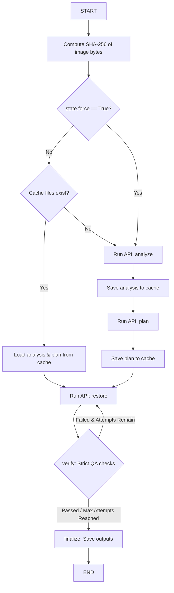

# Design Document: Photo Restoration Caching & Idempotency

**Date:** 2026-06-14  
**Status:** Approved  
**Author:** Antigravity AI Coding Assistant  

---

## 1. Overview & Objectives

To optimize the workflow and prevent redundant API usage, we will introduce a cache for both the photo analysis and the restoration plan. For a given input image:
- If cache files exist and `--force` is omitted, the workflow loads them immediately, bypassing the vision/text model calls.
- If cache files do not exist or `--force` is specified, the pipeline executes the model calls and saves the resulting files to the cache.
- The actual image generation (restoration) step remains dynamic and is executed on every run (preserving the retry loop for quality improvement).

---

## 2. Cache Key & Storage Location

- **Cache Key**: The cache uses the content's SHA-256 hash of the input image bytes. This ensures renaming files doesn't break the cache, but editing the image correctly invalidates it.
- **Cache Location**: Cached documents will be saved under the `.cache` folder inside the configured output directory (e.g. `restored_photos/.cache/`):
  - `restored_photos/.cache/<sha256>_analysis.json`
  - `restored_photos/.cache/<sha256>_plan.txt`

---

## 3. Schema & CLI Interface

### 3.1. `RestorationState`
We add `base_dir` and `force` fields to the state schema in [photo_repair/state.py](file:///Users/jpwhite/Code/ai-photo-repair-pipeline/photo_repair/state.py):
```python
class RestorationState(BaseModel):
    # Output directory and override flag
    base_dir: str = "restored_photos"
    force: bool = False
```

### 3.2. CLI parser (`photo_repair/cli.py`)
We add a `--force` flag:
```python
parser.add_argument(
    "--force", action="store_true", help="Force recreation of analysis and plan."
)
```

---

## 4. Architectural Node Flow



---

## 5. File Modifications Map

- **`photo_repair/state.py`**:
  - Add `base_dir: str = "restored_photos"` and `force: bool = False` to `RestorationState`.
- **`photo_repair/cli.py`**:
  - Add `--force` to the command line parser arguments.
  - Pass the force flag when building the runner and calling `restore_photo()`.
- **`photo_repair/graph.py`**:
  - Update `restore_photo()` signature to accept `force` and include it in the initial state initialization.
- **`photo_repair/storage.py`**:
  - Implement caching utility helpers: `get_image_hash()`, `get_cached_analysis()`, `save_cached_analysis()`, `get_cached_plan()`, and `save_cached_plan()`.
- **`photo_repair/nodes.py`**:
  - Import the new cache utilities from `storage`.
  - Update `analyze_node` to check for cached analysis first unless `state.force` is True. Save cache on success.
  - Update `plan_node` to check for cached plan first unless `state.force` is True. Save cache on success.
- **`tests/`**:
  - Add unit tests for cache utility helpers in `test_storage.py`.
  - Add tests validating node cache-hit and cache-miss execution in `test_nodes.py`.
