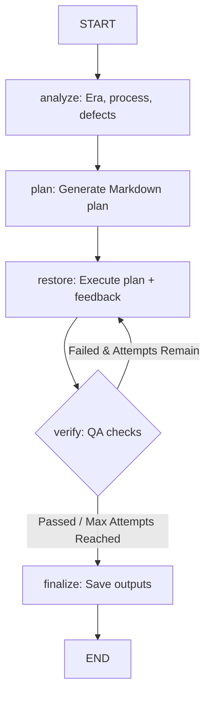

# Design Document: Optimized Photo Restoration Workflow

**Date:** 2026-06-14  
**Status:** Approved  
**Author:** Antigravity AI Coding Assistant  

---

## 1. Overview & Objectives

The goal is to optimize the AI photo restoration pipeline by introducing:
1. **Explicit Planning Step**: A separate graph node (`plan`) that generates a detailed, step-by-step restoration plan before rendering/restoring.
2. **Dynamic Feedback Execution**: A modified `restore` step that executes the generated plan and adapts to specific issues on retries.
3. **Strict Verification**: An expanded `VerificationResult` schema verifying that people, clothing, background elements, text, and original image tonality/grain match the original.

---

## 2. Architectural Design (Approach A: Linear Node Chain with Feedback Loop)

We use a linear pipeline that adds a `plan` node. The plan is created once. If verification fails, the pipeline routes back to `restore`, appending the verifier's feedback to the execution prompt.

### Graph Flow


---

## 3. Schema & State Changes

We will modify [photo_repair/state.py](file:///Users/jpwhite/Code/ai-photo-repair-pipeline/photo_repair/state.py).

### 3.1. `RestorationState`
We add a `plan` field to store the generated restoration plan:
```python
class RestorationState(BaseModel):
    # Existing fields
    input_path: str
    image_bytes: bytes
    mime_type: str = "image/png"
    analysis: RestorationAnalysis | None = None
    
    # New Field
    plan: str | None = None
    
    restored_bytes: bytes | None = None
    verification: VerificationResult | None = None
    output_path: str | None = None
    attempts: int = 0
    notes: list[str] = Field(default_factory=list)
    current_step: str = "initialized"
```

### 3.2. `VerificationResult`
We expand the verification schema to track specific domain matches:
```python
class VerificationResult(BaseModel):
    composition_preserved: bool
    identity_preserved: bool
    clothing_preserved: bool                 # New: Clothes/styles match
    environment_preserved: bool              # New: Background/scenery/objects match
    no_hallucinations_or_artifacts: bool     # New: No AI errors (limbs, distortions)
    text_and_signage_preserved: bool         # New: Readability and value of text kept
    tonality_and_grain_preserved: bool       # New: Authentic photo grain kept
    quality_ok: bool
    issues: list[str] = Field(default_factory=list)

    @property
    def passed(self) -> bool:
        return (
            self.composition_preserved
            and self.identity_preserved
            and self.clothing_preserved
            and self.environment_preserved
            and self.no_hallucinations_or_artifacts
            and self.text_and_signage_preserved
            and self.tonality_and_grain_preserved
            and self.quality_ok
        )
```

---

## 4. Prompt Engineering

We will modify [photo_repair/prompts.py](file:///Users/jpwhite/Code/ai-photo-repair-pipeline/photo_repair/prompts.py).

### 4.1. Planning Prompt (New: `PLANNING_PROMPT`)
```python
PLANNING_PROMPT = (
    "You are a Master Archival Photo Restorer. Analyze this photograph and its condition report:\n"
    "Era: {era}, Process: {process}, Defects: {defects}, Black & White: {is_bw}.\n"
    "Draft a step-by-step restoration plan to repair this photograph.\n"
    "Your plan must address how to repair each defect (e.g. scratch removal, de-noising, color restoration) "
    "using period-accurate techniques. Detail what elements must be preserved exactly (facial structures, "
    "clothing styles, background scenery) and define the final target aesthetic (e.g., preserving authentic "
    "film grain, avoiding an airbrushed/plastic look). Output a detailed plan in markdown format."
)
```

### 4.2. Restore Prompt Helper
```python
def build_restore_prompt(plan: str, issues: list[str] | None = None) -> str:
    prompt = (
        "Restore this photograph by executing the following restoration plan exactly. "
        "Do not change the composition, people's identities, or add new elements.\n\n"
        f"RESTORATION PLAN:\n{plan}"
    )
    if issues:
        bullet_points = "\n".join(f"- {issue}" for issue in issues)
        prompt += (
            "\n\nCRITICAL: A previous restoration attempt failed verification with these issues. "
            "You MUST correct these specific errors in this run:\n"
            f"{bullet_points}"
        )
    return prompt
```

### 4.3. Verification Prompt (Updated: `VERIFY_PROMPT`)
```python
VERIFY_PROMPT = (
    "You are reviewing a restored photograph (second image) against its original (first image).\n"
    "Examine both images and check the following criteria strictly. If a criterion is violated, "
    "set its field to false and list the reason in 'issues':\n\n"
    "1. composition_preserved: True if framing, crop, and layout of subjects are identical.\n"
    "2. identity_preserved: True if facial structure, features, and expressions of all people match.\n"
    "3. clothing_preserved: True if clothing style, details, fabrics, and patterns match.\n"
    "4. environment_preserved: True if scenery, background details, lighting, and objects match.\n"
    "5. no_hallucinations_or_artifacts: True if free of extra limbs, floating artifacts, or distortions.\n"
    "6. text_and_signage_preserved: True if text/writing is legible and matches the original.\n"
    "7. tonality_and_grain_preserved: True if authentic film grain and exposure contrast are kept (no plastic/over-smoothed look).\n"
    "8. quality_ok: True if overall restoration is clean and professional.\n\n"
    "Identify any issues carefully."
)
```

---

## 5. File Modifications Map

- **`photo_repair/state.py`**:
  - Add `plan` to `RestorationState`.
  - Add new fields to `VerificationResult`.
- **`photo_repair/prompts.py`**:
  - Add `PLANNING_PROMPT`.
  - Add `build_restore_prompt`.
  - Update `VERIFY_PROMPT`.
- **`photo_repair/image_client.py`**:
  - Add `plan()` method to generate the markdown plan via vision/text model.
  - Update `restore()` method to construct the prompt with `build_restore_prompt` and accept `issues`.
- **`photo_repair/nodes.py`**:
  - Add `plan_node` to execute planning.
  - Update `restore_node` to pass the plan and failed verification issues on retries.
- **`photo_repair/graph.py`**:
  - Add `"plan"` node to graph structure.
  - Add edges: `START -> analyze -> plan -> restore`.
- **`tests/`**:
  - Update tests to mock/validate the planning node and expanded verification fields.

---

## 6. Testing Strategy

1. **Unit Tests**:
   - Mock API responses for the new `plan` capability in `test_image_client.py`.
   - Update `test_state.py` and `test_nodes.py` to assert the plan is stored, passed to restoration, and verification parses the new boolean schema fields correctly.
   - Update CLI/graph execution tests.
2. **Integration Verification**:
   - Run `pytest` to ensure all tests pass with mocked inputs.
